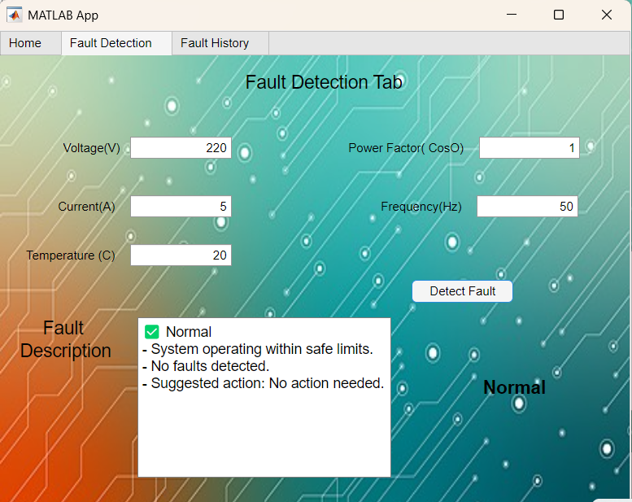
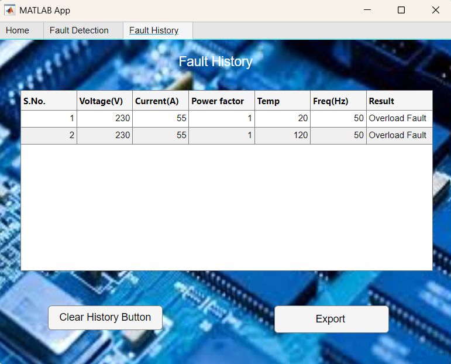
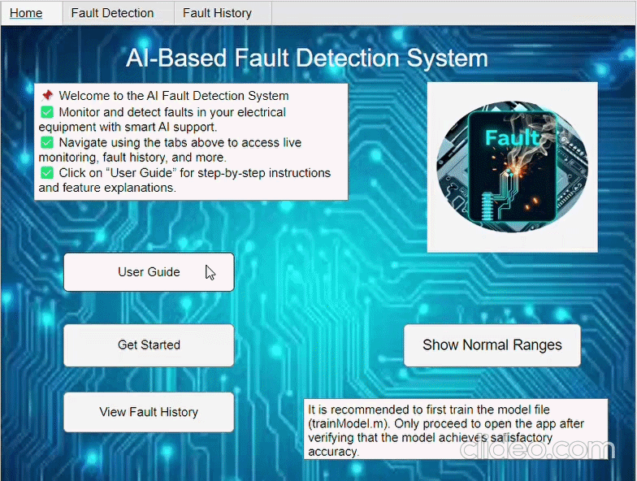

# AI-Based Electrical Fault Detection System

A **machine learning-based system** for detecting electrical faults using **MATLAB and Neural Networks**.
The system analyzes electrical parameters such as **voltage, current, temperature, power factor, and frequency** to classify possible electrical faults.

---

# Project Overview

Electrical systems often experience faults such as **voltage fluctuations, overload conditions, and thermal issues**.
Traditional monitoring methods rely on **manual inspection or fixed thresholds**, which may fail to detect complex fault patterns.

This project implements an **AI-based fault detection system** that uses a **Neural Network model trained on electrical parameter data**.
The trained model is integrated into a **MATLAB App Designer interface** that allows users to input electrical parameters and detect faults in real time.

---

# Features

* Machine learning-based fault classification
* MATLAB App Designer graphical interface
* Real-time fault detection
* Fault description display
* Fault history logging
* Export functionality for recorded faults

---

# Dataset

The model is trained using a **custom dataset** containing electrical system parameters.

## Input Features

* Voltage (V)
* Current (A)
* Power Factor (Cosφ)
* Temperature (°C)
* Frequency (Hz)

## Output Classes

* Normal
* Voltage Fluctuation
* Power Factor Issue
* Thermal Overload
* Overload Fault

The dataset contains **1200 samples** generated using realistic operating ranges of electrical systems.

---

# Machine Learning Model

The system uses a **Pattern Recognition Neural Network** implemented in MATLAB.

## Model Configuration

* **Input Features:** 5
* **Hidden Layer:** 12 neurons
* **Training Algorithm:** Levenberg-Marquardt (`trainlm`)
* **Performance Function:** Cross-Entropy
* **Data Split:**

  * 70% Training
  * 30% Testing

---

# Data Preprocessing

The following preprocessing steps are applied before training the neural network:

1. Load dataset from CSV file
2. Remove missing values
3. Normalize input features using **Min-Max scaling**
4. Convert fault labels to **one-hot encoded vectors**
5. Train neural network model

---

# MATLAB Application Interface

The system includes a **MATLAB App Designer GUI** with three main tabs.

---

## Home Tab

Provides system overview and navigation.

Functions include:

* User guide
* Access to fault detection module
* Display of normal operating ranges
* Navigation to fault history

---

## Fault Detection Tab

Users can input electrical parameters:

* Voltage
* Current
* Temperature
* Power Factor
* Frequency

After clicking **Detect Fault**, the system performs the following steps:

1. Normalize input values
2. Pass inputs to the trained neural network
3. Predict the fault type
4. Display detected fault and description

---

## Fault History Tab

Stores previously detected faults.

Displayed information:

* Voltage
* Current
* Power Factor
* Temperature
* Frequency
* Detected Fault

Additional features:

* Clear history
* Export results

---

# Project Structure

```text
AI-Fault-Detection-System
│
├── trainModel.m
├── FaultDetectionApp.mlapp
├── data.csv
├── FaultDetectionNN.mat
│
├── screenshots
│   ├── home_tab.png
│   ├── fault_detection_tab.png
│   ├── fault_history_tab.png
│   └── training_results.png
│
├── demo
│   └── app_demo.gif
│
├── assets
│   ├── background.png
│   ├── logo.png
│
└── README.md
```

---

# System Workflow

```text
Electrical Parameters
        │
        ▼
Dataset (CSV)
        │
        ▼
Data Preprocessing
        │
        ▼
Neural Network Training
        │
        ▼
Saved Model (.mat)
        │
        ▼
MATLAB App Interface
        │
        ▼
Fault Prediction
```

---

# Application Screenshots

### Home Interface


---

### Fault Detection Interface



---

### Fault History Interface



---


## Application Demo



---

# How to Run the Project

1. Clone the repository

```
git clone https://github.com/AnkitHarsh54/AI-Fault-Detection-System.git
```

2. Open MATLAB

3. Run the training script

```
trainModel.m
```

4. Launch the MATLAB App

```
FaultDetectionApp.mlapp
```

---

# Model Training Results

The neural network training converged successfully.

* **Epochs completed:** 21
* **Final Performance (MSE):** 3.34e-09
* **Training Status:** Reached minimum gradient

Training algorithm:

* Levenberg-Marquardt (`trainlm`)
* Performance metric: Mean Squared Error

---


# Future Improvements

Possible enhancements include:

* Integration with **IoT sensors for real-time monitoring**
* Cloud-based fault logging
* Deployment as a **standalone executable application**
* Support for **additional electrical fault types**

---

# Author

Developed by **Ankit Harsh**
Electrical Engineering Student
